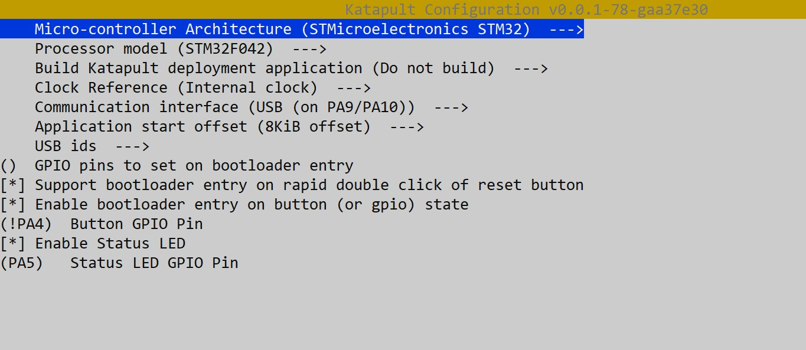
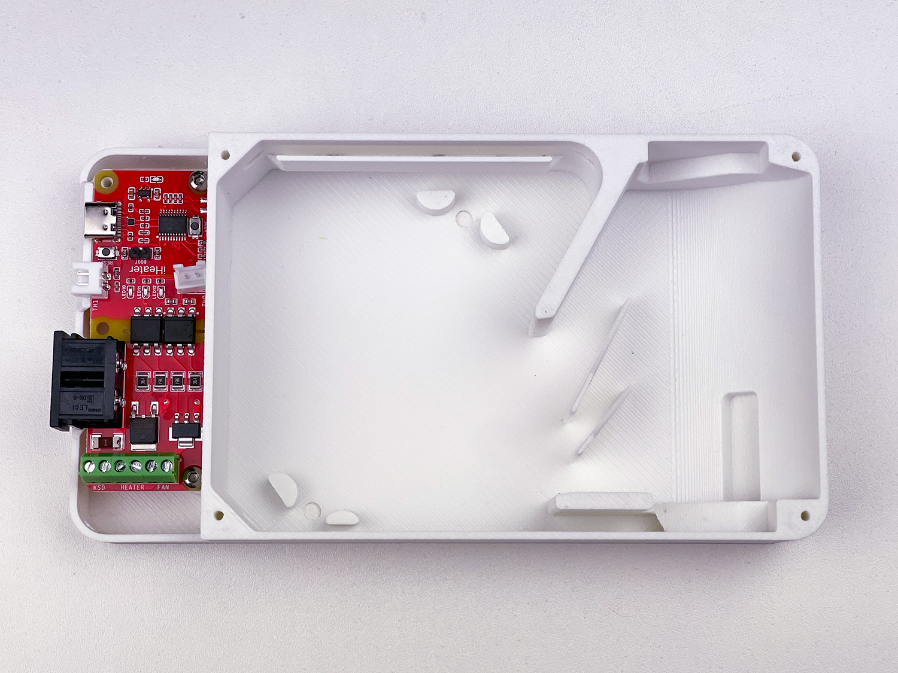
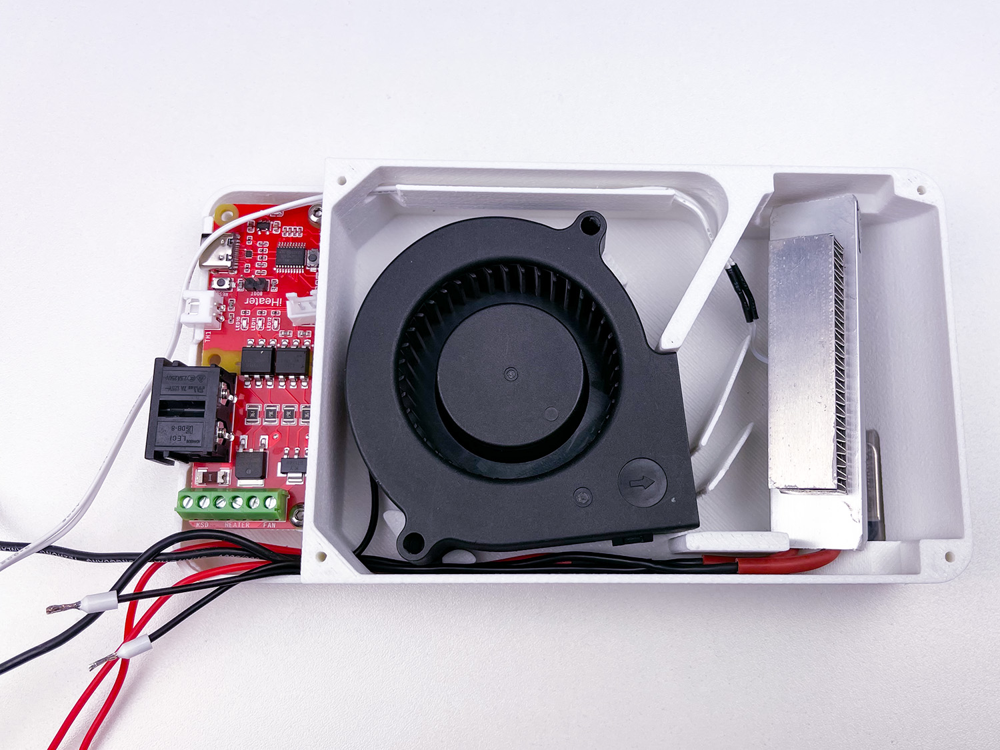
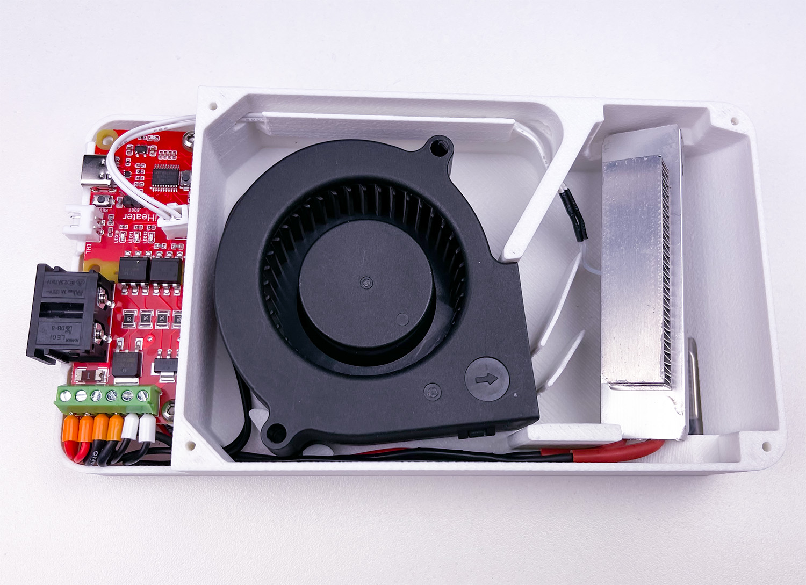
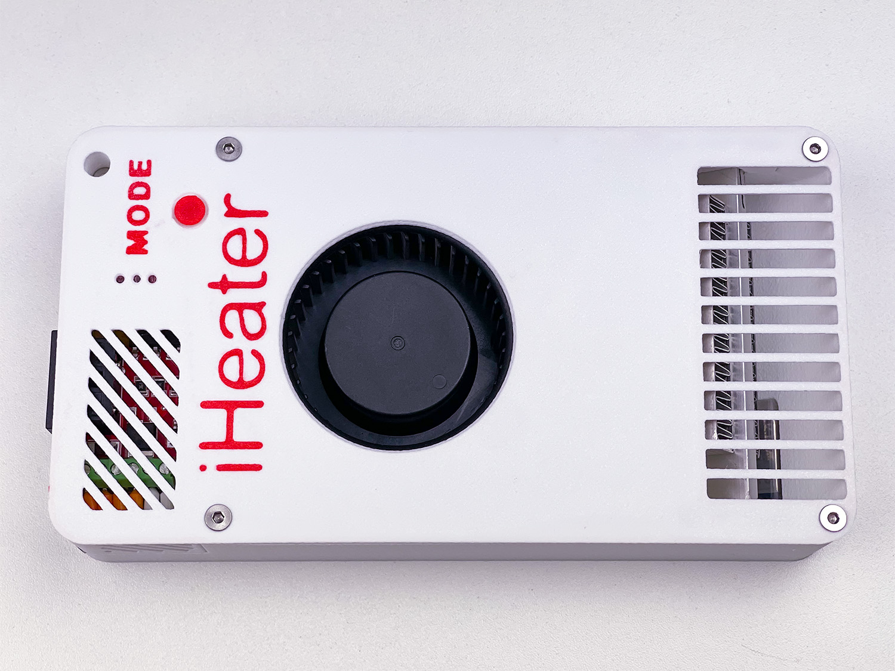
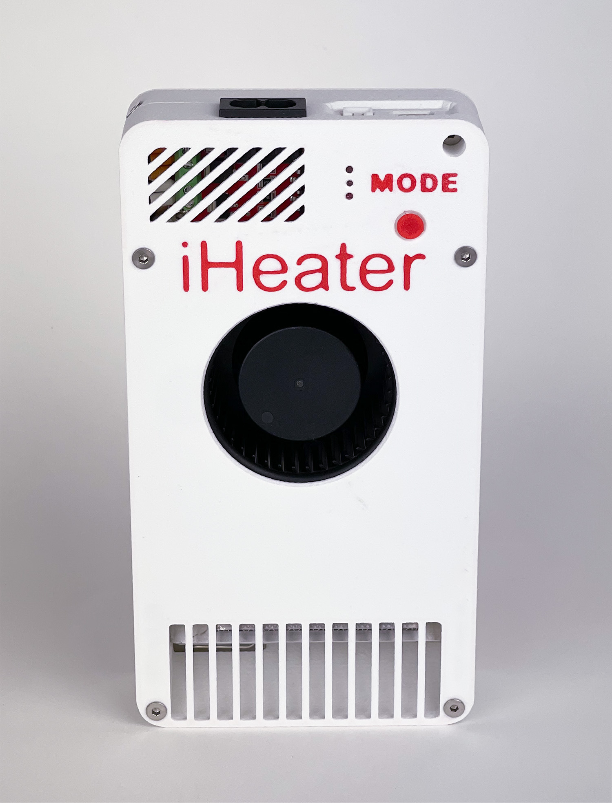

# О проекте iHeater

iHeater — это компактное и доступное решение для 3D-принтеров без активной термокамеры или с ограниченными возможностями подключения к материнской плате. Он особенно полезен для моделей с проприетарными платами, где нет свободных разъёмов для вентилятора, нагревателя или термистора. iHeater решает эту задачу простым и универсальным способом.

Может работать самостоятельно с собственной прошивкой как отдельное устройство или под управлением Klipper с подключением к принтеру по USB


## Варианты использования
### Под управлением Klipper

Плата работает как отдельный MCU в Klipper, полностью автономно управляя нагревом камеры и вентилятором. Благодаря питанию от 220 В, iHeater не нагружает блок питания принтера, что особенно важно, учитывая, что штатные БП часто работают на пределе.


Стоимость платы сопоставима или даже ниже, чем самостоятельная сборка аналогичного решения на базе обычного микроконтроллера, твердотельного реле и других необходимых комплектующих. Тем не менее, для энтузиастов остаётся возможность собрать аналог самостоятельно.

iHeater — это простой способ добавить нагрев камеры в ваш принтер, для повышения качества печати и расширения диапазона применяемых материалов.


### С прошивкой iHeater

[](https://github.com/pavluchenkor/iHeater-Standalone-Firmware)

Плата iHeater является самодостаточной и имеет всю необходимую периферию и интерфейс управления и отображения для использования как самостоятельное устройство. Необходимая температура задается последовательным нажатием кнопки MODE, а выбранная температура кодируется и отображается тремя светодиодами. Приращение можно изменить в прошивке.

Нажатие |LED1 |LED2 |LED3 | °C |BIN |DEC
-|-|-|-|-|-|-
1	|0	|0	|1	|45 °C	|0b001	|1
2	|0	|1	|0	|50 °C	|0b010	|2
3	|0	|1	|1	|55 °C	|0b011	|3
4	|1	|0	|0	|60 °C	|0b100	|4
5	|1	|0	|1	|65 °C	|0b101	|5
6	|1	|1	|0	|70 °C	|0b110	|6
7	|1	|1	|1	|75 °C	|0b111	|7


## Установка
### Конфигурация iHeater для Klipper

Данный раздел содержит конфигурационные файлы для нагревателя камеры 3D-принтера iHeater на основе прошивки Klipper и одноименной платы управления. Конфигурация предназначена для управления нагревом камеры и вентиляторами с помощью микроконтроллера iHeater.

### Требования

#### Аппаратное обеспечение
  - Плата управления iHeater
  - Терморезисторы NTC 100K 3950 (2 шт.)
  - PTC нагревательный элемент 220В 100Вт, для камеры
  - Вентилятор 7530 220В, для циркуляции воздуха в камере
  - Термофьюз KSD9700 или аналогичный (220В 5А 130С)

#### Программное обеспечение
  - Klipper (последняя версия)
  - Настроенный и работающий хост с Klipper

### Подготовка

#### Сборка аппаратной части
   - Подключите нагревательный элемент и вентилятор к iHeater.
   - Подключите KSD в соответствующий разъем.
   - Установите терморезисторы в камере и подключите их к соответствующим пинам MCU.
   - Убедитесь в правильности подключения пинов согласно конфигурационному файлу.

#### Установка необходимых файлов
   - Скопируйте файл iHeater.cfg в директорию конфигурации Klipper.


### Установка Katapult Bootloader

Этот документ содержит инструкции по сборке и прошивке загрузчика **Katapult** от Klipper для микроконтроллера **STM32F042F6P6**. Загрузчик Katapult позволяет прошивать прошивку Klipper по USB без ST-Link.

---

#### Что потребуется

- STM32F042F6P6
- Плата iHeater
- ST-Link V2 программатор (для первой прошивки) или USB кабель
- Linux-система (например, Raspberry Pi или принтер)

---

#### Сборка Katapult

1. Клонируем репозиторий Katapult:

```bash
git clone https://github.com/Arksine/katapult
cd katapult
make menuconfig
```

2. В `menuconfig` выбери:

- MCU Architecture: STM32
- Processor model: STM32F042
- Clock Reference: Internal
- Communication interface: USB (on PA9/PA10)
- Application start offset: **8KiB offset**
- [x] Support bootloader entry on rapid double click of reset button
- [x] Enable bootloader entry on button (or gpio) state
- (!PA4)  Button GPIO Pin
- [X] Enable Status LED
- (PA5)   Status LED GPIO Pin




3. Сборка:

```bash
make
```

Прошивка будет создана в `out/katapult.bin`.


---

#### Прошивка Katapult через DFU

> Этот шаг нужен только один раз, для загрузки самого Katapult.

##### Подготовка:
Установи утилиту dfu-util, если она ещё не установлена:
    
    sudo apt install dfu-util

Установи джампер на BOOT0 и перезапусти питание платы (или нажми кнопку RESET).
Микроконтроллер загрузится в режим DFU.

Проверь подключение:

    lsusb

Ты должен увидеть:

    ID 0483:df11 STMicroelectronics STM Device in DFU Mode

##### Прошивка Katapult:
Выполни команду:

    dfu-util -a 0 -D out/katapult.bin -s 0x08000000:leave

Пример успешной прошивки:

    Downloading to address = 0x08000000, size = 4968
    Download        [=========================] 100%         4968 bytes
    Download done.
    File downloaded successfully
    Transitioning to dfuMANIFEST state

Сними перемычку, держивая кнопку MODE нажми и отпусти кнопку RESET(или переподключи USB-кабель).

После перезапуска плата появится как:

    ls /dev/serial/by-id/*

    /dev/serial/by-id/usb-katapult_stm32f042x6_XXXXXXXXXXXXXX-if00

Если нет прав, возможны ошибки при прошивке, чтобы получить доступ выполни команду:
```
sudo chmod 777 /dev/serial/by-id/usb-katapult_stm32f042x6_XXXXXXXXXXXXXX-if00
``` 

[Установи прошивку Klipper]('/iHeater/README_ru.md#iheater_1')

#### Прошивка Katapult через ST-Link

> Этот шаг нужен только один раз, для загрузки самого Katapult.

##### Подключение ST-Link:

| ST-Link | STM32     |
|---------|-----------|
| SWDIO   | PA13      |
| SWCLK   | PA14      |
| GND     | GND       |
| 3.3V    | VDD       |

##### Установка утилиты `st-flash`:

```bash
sudo apt install stlink-tools
```

##### Прошивка:

```bash
sudo st-flash write out/katapult.bin 0x08000000
```

Если всё в порядке, появится сообщение:

```
Flash written and verified! jolly good!
```

#### Примечания

- Katapult занимает первые 8 КБ Flash, поэтому **в Klipper обязательно указывать смещение 8 KiB**.
- Можно использовать либо двойной Reset, либо кнопку на GPIO (PA4) для входа в DFU.
- Если PA13/PA14 используются для SWD
- После прошивки Katapult можно больше не использовать ST-Link — вся дальнейшая работа по USB.


## Установка прошивки на iHeater

### Соберите прошивку Klipper для stm32f042

   cd klipper/
   make menuconfig

#### В меню конфигурации выберите

    Enable extra low-level configuration options
    
    Micro-controller Architecture (STMicroelectronics STM32)

    Processor model (STM32F042)

    Bootloader offset (8KiB bootloader)

    Clock Reference (Internal clock)

    Communication interface (USB (on PA9/PA10))

#### Выключите все лишнее

        [*] Support micro-controller based ADC (analog to digital)
        [ ] Support communicating with external chips via SPI bus
        [ ] Support communicating with external chips via I2C bus
        [*] Support GPIO based button reading
        [ ] Support Trinamic stepper motor driver UART communication
        [ ] Support 'neopixel' type LED control
        [ ] Support measuring fan tachometer GPIO pins
            *** LCD chips ***
        [ ] Support ST7920 LCD display
        [ ] Support HD44780 LCD display
            *** External ADC type chips ***
        [ ] Support HX711 and HX717 ADC chips


#### Сохраните и выйдите из меню.

#### Скомпилируйте прошивку

        make clean
        make

    !!! Результат должен выглядеть так:

        Creating hex file out/klipper.bin

### Установка прошивки на плату iHeater

    При необходимости установите python3-serial
        
        sudo apt install python3-serial

**Далее рассматривается вариант установки с установленным бутлоадером Katapult**

- Подключите iHeater к хосту в режиме программирования (удерживая кнопку Mode при подключении или дважды нажав RESET).

- Выполните поиск 

        ls /dev/serial/by-id/

    !!! Результат должен выглядеть так:

        usb-katapult_stm32f042x6_0C0018000D53304347373020-if00

    - При необходимости установите flashtool

    ```
    pip install flashtool
    ```

- Измените на ID свой и введите:
    
        python3 ~/katapult/scripts/flashtool.py -d /dev/serial/by-id/usb-katapult_stm32f042x6_0C0018000D53304347373020-if00 -f ~/klipper/out/klipper.bin

    !!! Результат должен выглядеть так:

        Flashing '/home/pi/klipper/out/klipper.bin'...

        [##################################################]
        
        Write complete: 20 pages
        
        Verifying (block count = 319)...
        
        [##################################################]
        
        Verification Complete: SHA = 8A3DDF39A0E70B684DC6BAF74EF8F089EBDD6C18
        
        Flash Success

- Проверьте: 
        
            ls /dev/serial/by-id/

    !!! Результат должен выглядеть так:

        usb-Klipper_stm32f042x6_0C0018000D53304347373020-if00

    ```iHeater готов для работы с Klipper```

---


## Конфигурация Klipper

Скопируйте конфигурационные файлы iHeater.cfg в папку с файлом printer.cfg и подключите его в printer.cfg с помощью директивы [include]


```
cd ~/klipper_config
```

```
wget https://github.com/pavluchenkor/iHeater/blob/main/iHeater.cfg
```

Откройте printer.cfg и добавьте

    [include iHeater.cfg]

## Подключение MCU iHeater

Измените файл iHeater.cfg, укажите полученный ID

```
    [mcu iHeater]
    serial: usb-Klipper_stm32f042x6_0C0018000D53304347373020-if000
```


## Использование

## Команды управления нагревом камеры
- Установка температуры камеры:
 

        M141 S60  ; Устанавливает температуру камеры на 60°C

- Ожидание достижения температуры:

        M191 S60  ; Ждет, пока температура камеры достигнет 60°C

- Остановка нагрева камеры:

        M141 S0   ; Отключает нагрев камеры

- В завершении G-кода слайсера добавьте `M141 S0`, чтобы корректно отключить нагрев камеры.

## Конфигурация GPIO

| Pin    | Alias       | Function                          |
|--------|-------------|-----------------------------------|
| PA0    | TH1         | Температурный датчик камеры       |
| PA1    | HEATER      | Управление нагревателем           |
| PA2    | FAN         | Управление вентилятором           |
| PA3    | TH0         | Температурный датчик нагревателя  |
| PA4    | MODE        | Кнопка режима                     |
| PA5    | LED3        | Светодиод 3                       |
| PA6    | LED2        | Светодиод 2                       |
| PA7    | LED1        | Светодиод 1                       |


## Примечания
- Безопасность:

    - Убедитесь, что все подключения выполнены правильно и безопасно.
    - Проверьте, что значения min_temp и max_temp соответствуют спецификациям оборудования.

- Проверка оборудования:
    - Перед использованием протестируйте работу нагревателя и вентилятора.
    - Следите за температурой во время первых запусков.
- Настройка PID:
    - При необходимости выполните калибровку PID для точного контроля температуры.

## CAD файлы iHeater

В этой директории находятся 3D-модели компонентов корпуса и креплений устройства iHeater.

### Список файлов

| Файл | Описание |
|------|----------|
| [`Base.stl`](CAD/Base.stl) | Основание корпуса, на котором крепятся все компоненты |
| [`Cover Two Color.stl`](CAD/Cover%20Two%20Color.stl) | Верхняя крышка  печатается в два цвета|
| [`Cover.stl`](CAD/Cover.stl) | Верхняя крышка|
| [`iHeater.stp`](CAD/iHeater.stp) | Полная сборка в формате STEP (для CAD-систем) |

### Форматы файлов

- `.stl` — используется для 3D-печати.
- `.stp` — используется для редактирования сборки в CAD-программах (Fusion 360, FreeCAD и т.д.).

### Как использовать

1. Откройте [`iHeater.stp`](CAD/iHeater.stp) в вашей CAD-программе для обзора всей сборки.
2. Загрузите STL-файлы в ваш слайсер для подготовки к 3D-печати.
3. Убедитесь, что при импорте выбран масштаб **миллиметры (mm)**.

### Примечания

- Убедитесь, что вентиляционные отверстия не перекрыты при установке.
- STL-файлы оптимизированы для печати без поддержки.

---

[_Если вы редактируете CAD-файлы — не забудьте обновить и этот документ!_](User%20mods/README.md)

## Сборка

### Установка платы


### Установка Термистора и KSD


### Установка нагревателя


### Проводка


### Установка НШВИ


### Коммутация


### Финальная сборка


### Готовое изделие



## Лицензия
Данный проект распространяется под лицензией MIT. Подробности смотрите в файле [LICENSE](license.md).


>⚠️  ** Внимание: Использование нагревательных элементов и управление температурой связано с риском возгорания и повреждения оборудования. Всегда следуйте рекомендациям производителя и соблюдайте меры предосторожности.