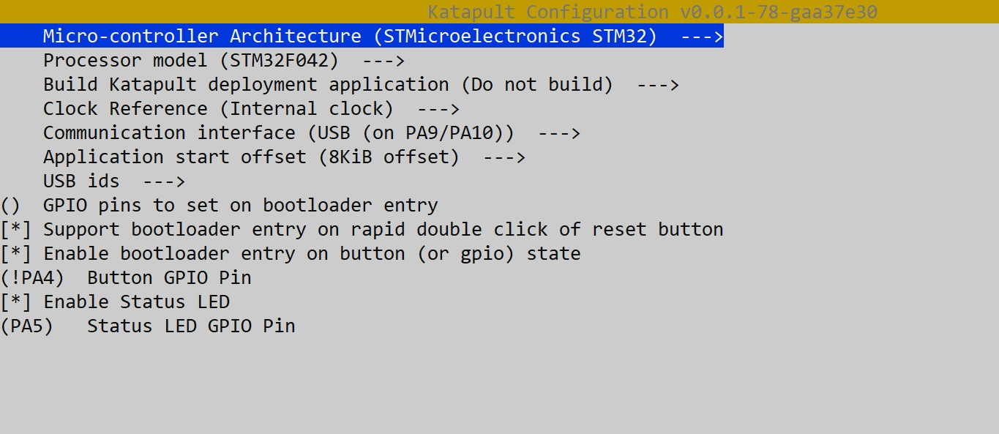
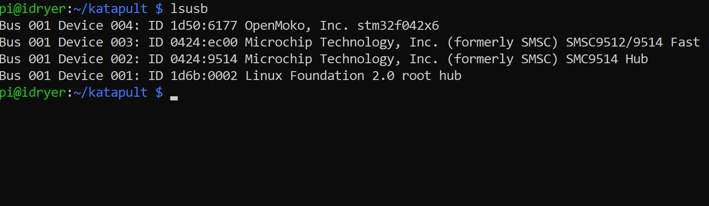

# Katapult Bootloader for STM32F042F6P6

Этот документ содержит инструкции по сборке и прошивке загрузчика **Katapult** от Klipper для микроконтроллера **STM32F042F6P6**. Загрузчик Katapult позволяет прошивать прошивку Klipper по USB без ST-Link, через DFU.

---

## 🧰 Что потребуется

- STM32F042F6P6
- Плата iHeater
- ST-Link V2 программатор (для первой прошивки)
- Linux-система (например, Raspberry Pi или принтер)

---

## ⚙️ Сборка Katapult

1. Клонируем репозиторий Katapult:

```bash
git clone https://github.com/Klipper3d/katapult
cd katapult
make menuconfig
```

2. В `menuconfig` выбери:

- `MCU Architecture`: STM32
- `Processor model`: STM32F042
- `Clock Reference`: Internal
- `Communication interface`: USB (on PA9/PA10)
- `Application start offset`: **8KiB offset**
- `[x] Support bootloader entry on rapid double click of reset button`
- `[x] Enable bootloader entry on button (or gpio) state` → GPIO: `PA4` 
- `[X] Enable Status LED` *(Включите PA5)*




3. Сборка:

```bash
make
```

Прошивка будет создана в `out/katapult.bin`.

---

## 🔌 Прошивка Katapult через ST-Link

> Этот шаг нужен только один раз, для загрузки самого Katapult.

### Установка утилиты `st-flash`:

```bash
sudo apt install stlink-tools
```

### Подключение ST-Link:

| ST-Link | STM32     |
|---------|-----------|
| SWDIO   | PA13      |
| SWCLK   | PA14      |
| GND     | GND       |
| 3.3V    | VDD       |

### Прошивка:

```bash
sudo st-flash write out/katapult.bin 0x08000000
```

Если всё в порядке, появится сообщение:

```
Flash written and verified! jolly good!
```

---

## 🚀 Проверка Katapult

1. Убедитесь, что `BOOT0 = 0`
2. Подключите USB к плате
3. Дважды нажмите кнопку **Reset** или нажмите и удерживайте **MODE** при подключении или сбросе
4. Выполните:

```bash
lsusb
```

Ожидаемое устройство:

```
ID 1d50:614e OpenMoko, Inc. Katapult DFU Bootloader
```

---

## ⏫ Загрузка прошивки Klipper через Katapult

1. Соберите прошивку Klipper с учётом загрузчика (8 KiB offset):

```bash
cd ~/klipper
make menuconfig
```

- `MCU Architecture`: STM32
- `Processor`: STM32F042
- `Bootloader offset`: 8 KiB
- `Clock`: Internal
- `Interface`: USB

2. Сборка и прошивка:

```bash
make
make flash FLASH_DEVICE=/dev/ttyACM0
```

Или с помощью `flash-sdcard.py`:

```bash
python3 ~/klipper/scripts/flash-sdcard.py -f out/klipper.bin -d /dev/ttyACM0
```

---

## 📋 Примечания

- Katapult занимает первые 8 КБ Flash, поэтому **в Klipper обязательно указывать смещение 8 KiB**.
- Можно использовать либо двойной Reset, либо кнопку на GPIO (PA4) для входа в DFU.
- Если PA13/PA14 используются для SWD — не используйте их под Status LED в Katapult.
- После прошивки Katapult можно больше не использовать ST-Link — вся дальнейшая работа по USB.

