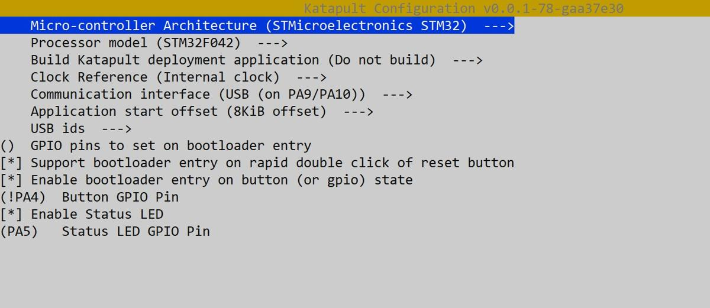

#  Прошивка

Этот документ содержит инструкции по сборке и прошивке загрузчика **Katapult** для микроконтроллера **iHeater**. Загрузчик Katapult позволяет прошивать прошивку Klipper по USB, а так же содержит документацию по установке прошивки **Klipper** на контроллер **iHeater** 

---

## Что потребуется

- STM32F042F6P6
- Плата iHeater
- ST-Link V2 программатор (для первой прошивки) или USB кабель
- Linux-система (например, Raspberry Pi или принтер)

!!! warning "Если нет возможности собрать и прошить прошивку на принтере"
    [Обратиттесь к разделу WSL](../iHeater/User-mods/software/WSL2_Ubuntu_FF/README.md)

---

## Сборка Katapult

1. Клонируем репозиторий Katapult:

```bash
git clone https://github.com/Arksine/katapult
cd katapult
make menuconfig
```

2. В `menuconfig` выбери:

<!-- - MCU Architecture: STM32
- Processor model: STM32F042
- Clock Reference: Internal
- Communication interface: USB (on PA9/PA10)
- Application start offset: **8KiB offset**
- [x] Support bootloader entry on rapid double click of reset button
- [x] Enable bootloader entry on button (or gpio) state
- (!PA4)  Button GPIO Pin
- [X] Enable Status LED
- (PA5)   Status LED GPIO Pin -->




3. Сборка:

```bash
make
```

Прошивка будет создана в `out/katapult.bin`.


---

## Прошивка Katapult через DFU

> Этот шаг нужен только один раз, для загрузки самого Katapult.

### Подготовка:
Установи утилиту dfu-util, если она ещё не установлена:
    
    sudo apt install dfu-util

Установи джампер на BOOT0 и перезапусти питание платы (или нажми кнопку RESET).
Микроконтроллер загрузится в режим DFU.

Проверь подключение:

    lsusb

Ты должен увидеть:

    ID 0483:df11 STMicroelectronics STM Device in DFU Mode

### Прошивка Katapult:
Выполни команду:

    dfu-util -a 0 -D out/katapult.bin -s 0x08000000:leave

Пример успешной прошивки:

    Downloading to address = 0x08000000, size = 4968
    Download        [=========================] 100%         4968 bytes
    Download done.
    File downloaded successfully
    Transitioning to dfuMANIFEST state

Сними перемычку, держивая кнопку MODE нажми и отпусти кнопку RESET(или переподключи USB-кабель).

После перезапуска плата появится как:

    ls /dev/serial/by-id/*

    /dev/serial/by-id/usb-katapult_stm32f042x6_XXXXXXXXXXXXXX-if00

Если нет прав, возможны ошибки при прошивке, чтобы получить доступ выполни команду:
```
sudo chmod 777 /dev/serial/by-id/usb-katapult_stm32f042x6_XXXXXXXXXXXXXX-if00
``` 

### Примечания

- Katapult занимает первые 8 КБ Flash, поэтому **в Klipper обязательно указывать смещение 8 KiB**.
- Можно использовать либо двойной Reset, либо кнопку на GPIO (PA4) для входа в DFU.
- Если PA13/PA14 используются для SWD
- После прошивки Katapult можно больше не использовать ST-Link — вся дальнейшая работа по USB.


## Установка прошивки на iHeater

### Компиляция прошивки
```
cd klipper/
make menuconfig
```

#### В меню конфигурации выберите
```
Enable extra low-level configuration options

Micro-controller Architecture (STMicroelectronics STM32)

Processor model (STM32F042)

Bootloader offset (8KiB bootloader)

Clock Reference (Internal clock)

Communication interface (USB (on PA9/PA10))
```
#### Выключите все лишнее
```
[*] Support micro-controller based ADC (analog to digital)
[ ] Support communicating with external chips via SPI bus
[ ] Support communicating with external chips via I2C bus
[*] Support GPIO based button reading
[ ] Support Trinamic stepper motor driver UART communication
[ ] Support 'neopixel' type LED control
[ ] Support measuring fan tachometer GPIO pins
    *** LCD chips ***
[ ] Support ST7920 LCD display
[ ] Support HD44780 LCD display
    *** External ADC type chips ***
[ ] Support HX711 and HX717 ADC chips
```

#### Сохраните и выйдите из меню.

#### Скомпилируйте прошивку
```
make clean
make
```

!!! Результат должен выглядеть так:

    Creating hex file out/klipper.bin

### Установка прошивки на плату iHeater

!!! note "При необходимости установите python3-serial"
    
    sudo apt install python3-serial

**Далее рассматривается вариант установки с установленным бутлоадером Katapult**

- Подключите iHeater к хосту в режиме программирования (удерживая кнопку Mode при подключении или дважды нажав RESET).

- Выполните поиск 

        ls /dev/serial/by-id/

    Результат должен выглядеть так:

        usb-katapult_stm32f042x6_0C0018000D53304347373020-if00

    - При необходимости установите flashtool

    ```
    pip install flashtool
    ```

- Измените на ID свой и введите:
    
        python3 ~/katapult/scripts/flashtool.py -d /dev/serial/by-id/usb-katapult_stm32f042x6_0C0018000D53304347373020-if00 -f ~/klipper/out/klipper.bin

    Результат должен выглядеть так:

        Flashing '/home/pi/klipper/out/klipper.bin'...

        [##################################################]
        
        Write complete: 20 pages
        
        Verifying (block count = 319)...
        
        [##################################################]
        
        Verification Complete: SHA = 8A3DDF39A0E70B684DC6BAF74EF8F089EBDD6C18
        
        Flash Success

- Проверьте: 
        
            ls /dev/serial/by-id/

    Результат должен выглядеть так:

        usb-Klipper_stm32f042x6_0C0018000D53304347373020-if00

    ```iHeater готов для работы с Klipper```


