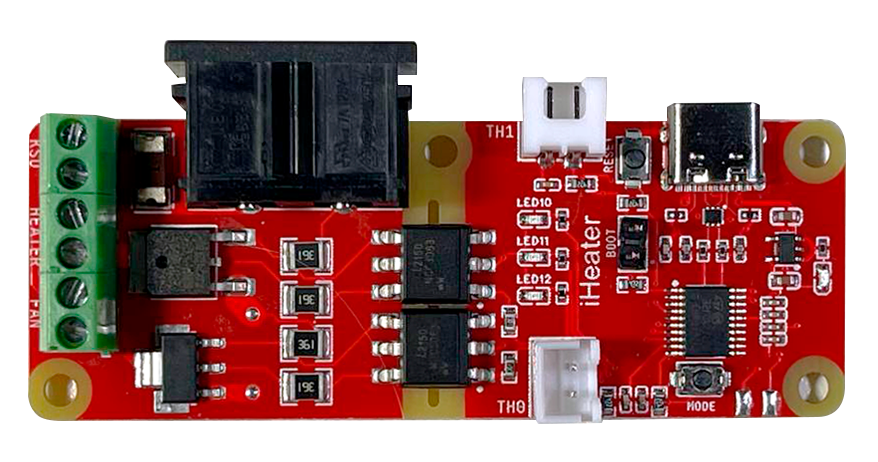

# Конфигурация iHeater для Klipper

Данный репозиторий содержит конфигурационные файлы для нагревателя камеры 3D-принтера iHeater на основе прошивки Klipper и одноименной платы управления. Конфигурация предназначена для управления нагревом камеры и вентиляторами с помощью микроконтроллера iHeater.



## Оглавление

- [Требования](#требования)
- [Подготовка](#подготовка)
- [Установка прошивки на iHeater](#установка-прошивки-на-iheater)
- [Конфигурация Klipper](#конфигурация-klipper)
  - [Подключение MCU `iHeater`](#1-подключение-mcu-iheater)
  - [Настройка нагревателя `iHeater_H`](#2-настройка-нагревателя-iheater_h)
  - [Настройка вентилятора `iHeater_F`](#3-настройка-вентилятора-iheater_f)
  - [Настройка датчиков температуры](#4-настройка-датчиков-температуры)
  - [Макросы G-кода](#макросы-g-кода)
- [Использование](#использование)
  - [Команды управления нагревом камеры](#команды-управления-нагревом-камеры)
  - [Автоматизация и логика управления](#автоматизация-и-логика-управления)
- [Примечания](#примечания)
- [Лицензия](#лицензия)

## Требования

- **Аппаратное обеспечение:**
  - Плата управления iHeater
  - Терморезисторы NTC 100K 3950 (2 шт.)
  - PTC нагревательный элемент 220В 100Вт, для камеры
  - Вентилятор 7530 220В, для циркуляции воздуха в камере
  - Термофьюз KSD9700 или аналогичный (220В 5А 130С)

- **Программное обеспечение:**
  - Klipper (последняя версия)
  - Настроенный и работающий хост с Klipper

## Подготовка

1. **Сборка аппаратной части:**
   - Подключите нагревательный элемент и вентиляторы к iHeater.
   - Подключите KSD в соответствующий разъем.
   - Установите терморезисторы в камере и подключите их к соответствующим пинам MCU.
   - Убедитесь в правильности подключения пинов согласно конфигурационному файлу.

2. **Установка необходимых файлов:**
   - Скопируйте файл iHeater.cfg в директорию конфигурации Klipper.

## Установка прошивки на iHeater

1. **Соберите прошивку Klipper для stm32f042:**

   cd klipper/
   make menuconfig


2. **В меню конфигурации выберите:**

    Enable extra low-level configuration options
    Micro-controller Architecture (STMicroelectronics STM32)
    Processor model (STM32F042)
    Bootloader offset (8KiB bootloader)
    Clock Reference (Internal clock)
    Communication interface (USB (on PA9/PA10))

3. **Выключите все лишнее**

    [*] Support GPIO "bit-banging" devices
    [ ] Support LCD devices
    [ ] Support thermocouple MAX sensors
    [ ] Support adxl accelerometers
    [ ] Support lis2dw and lis3dh 3-axis accelerometers
    [ ] Support MPU accelerometers
    [ ] Support HX711 and HX717 ADC chips
    [ ] Support ADS 1220 ADC chip
    [ ] Support ldc1612 eddy current sensor
    [ ] Support angle sensors
    [*] Support software based I2C "bit-banging"
    [ ] Support software based SPI "bit-banging"


4. Сохраните и выйдите из меню.

5. Скомпилируйте прошивку:

        make clean
        make

    !!! Результат должен выглядеть так:

        Creating hex file out/klipper.bin

6. Установка прошивки на плату iHeater:

    При необходимости установите python3-serial
        
        sudo apt install python3-serial

    !!! Далее рассматривается вариант установки с установленным бутлоадером Katapult```

- Подключите iHeater к компьютеру в режиме программирования (удерживая кнопку Mode при подключении).

- Выполните поиск 

        ls /dev/serial/by-id/

    !!! Результат должен выглядеть так:

        usb-katapult_stm32f042x6_0C0018000D53304347373020-if00

- Измените на ID свой и введите:
    
        python3 ~/katapult/scripts/flashtool.py -d /dev/serial/by-id/usb-katapult_stm32f042x6_0C0018000D53304347373020-if00 -f out/klipper.bin

    !!! Результат должен выглядеть так:

        Flashing '/home/pi/klipper/out/klipper.bin'...

        [##################################################]
        
        Write complete: 20 pages

        Verifying (block count = 319)...

        [##################################################]

        Verification Complete: SHA = 8A3DDF39A0E70B684DC6BAF74EF8F089EBDD6C18

        Flash Success

- Проверьте: 
        
            ls /dev/serial/by-id/

    !!! Результат должен выглядеть так:
        usb-Klipper_stm32f042x6_0C0018000D53304347373020-if00

    ```iHeater готов для работы с Klipper```

## Конфигурация пинов

| Pin    | Alias       | Function                          |
|--------|-------------|-----------------------------------|
| PA0    | TH1         | Температурный датчик нагревателя  |
| PA1    | HEATER      | Управление нагревателем           |
| PA2    | FAN         | Управление вентилятором           |
| PA3    | TH0         | Температурный датчик камеры       |
| PA4    | MODE        | Кнопка режима                     |
| PA5    | LED3        | Светодиод 3                       |
| PA6    | LED2        | Светодиод 2                       |
| PA7    | LED1        | Светодиод 1                       |


## Конфигурация Klipper

Скопируйте конфигурационные файлы iHeater.cfg в папку с файлом printer.cfg и подключите его в printer.cfg с помощью директивы [include]
        
    [include iHeater.cfg]

### 1. Подключение MCU iHeater

- Измените файл iHeater.cfg, укажите полученный ID

        [mcu iHeater]
        serial: usb-Klipper_stm32f042x6_0C0018000D53304347373020-if000

## Использование
### Команды управления нагревом камеры
- Установка температуры камеры:
 

        M141 S60  ; Устанавливает температуру камеры на 60°C

- Ожидание достижения температуры:

        M191 S60  ; Ждет, пока температура камеры достигнет 60°C

- Остановка нагрева камеры:

        M141 S0   ; Отключает нагрев камеры

- В завершении G-кода слайсера добавьте `M141 S0`, чтобы корректно отключить нагрев камеры.


## Примечания
- Безопасность:

    - Убедитесь, что все подключения выполнены правильно и безопасно.
    - Проверьте, что значения min_temp и max_temp соответствуют спецификациям оборудования.

- Проверка оборудования:
    - Перед использованием протестируйте работу нагревателя и вентилятора.
    - Следите за температурой во время первых запусков.
- Настройка PID:
    - При необходимости выполните калибровку PID для точного контроля температуры.


## Лицензия
Данный проект распространяется под лицензией MIT. Подробности смотрите в файле LICENSE.


>⚠️  ** Внимание: Использование нагревательных элементов и управление температурой связано с риском возгорания и повреждения оборудования. Всегда следуйте рекомендациям производителя и соблюдайте меры предосторожности.